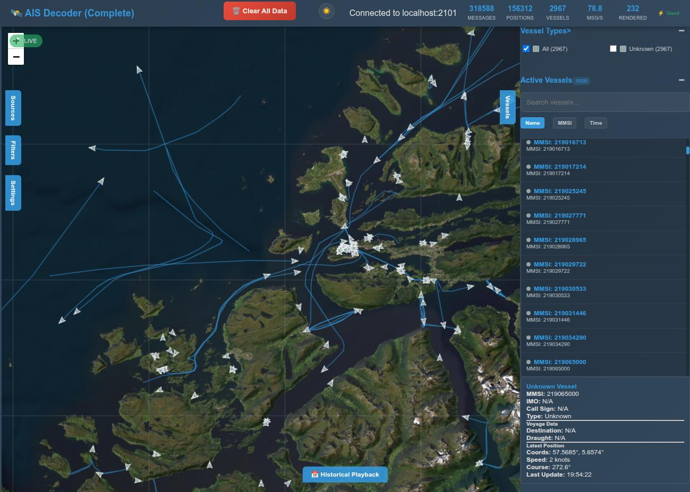

# AISMap

Decode and map NMEA Automated Identification System (AIS) sentences.

A quick and dirty monolithic HTML (with CSS and Javascript) tool to read, decode, and map NMEA AIS. Can process real-time via a websocket proxy (included), from a file of NMEA (AIVDM) sentences, or sentences pasted in manually.



## Features

- **Real-time processing**: TCP stream connection to AIS data sources via WebSocket proxy
- **Multiple input methods**: File upload, manual input, or real-time streaming
- **Interactive mapping**: Multiple base layers (dark, light, OSM, satellite) with vessel markers
- **Vessel tracking**: Dynamic icons, tracks, and detailed popups
- **Advanced filtering**: Vessel type filtering, searching, and sorting capabilities
- **User interface**: Sidebar panels for input sources, filters, settings, and vessel details
- **Performance monitoring**: Built-in performance indicators and optimization info
- **Playback controls**: Historical playback UI (logic implementation in progress)
- **Themes**: Day/night mode toggle with automatic map style switching
- **Base station support**: AIS base station detection and display
- **Responsive design**: Optimized for both desktop and mobile devices

## Usage

### Basic Usage
Load the file directly in your browser:
```
file:///$PATH/ais_map.html
```

### Real-time Processing
For real-time AIS data processing, run the WebSocket proxy:

```bash
python3 nmea_websocket_proxy.py --port 8080
```

Then configure the Sources with the IP and Port of your NMEA sentence source.

### Testing Setup
To test with sample data using netcat:

```bash
nc -lvp 2101 < nmea-sample.txt
```

Where `nmea-sample.txt` contains NMEA sentences in this format:
```
!AIVDM,1,1,,A,13HOI:0P0000VOHLCnHQKwvL05Ip,0*23
!AIVDM,1,1,,A,133sVfPP00PD>hRMDH@jNOvN20S8,0*7F
!AIVDM,1,1,,B,100h00PP0@PHFV`Mg5gTH?vNPUIp,0*3B
!AIVDM,1,1,,B,13eaJF0P00Qd388Eew6aagvH85Ip,0*45
```

With the proxy running, set:
- **Sources IP Address**: localhost  
- **Port**: 2102

### Alternative Input Methods
- **File Upload**: Use the Sources-Files tab to load `nmea-sample.txt`
- **Manual Entry**: Paste individual or multiple NMEA AIS sentences into Sources-Manual

## Message Type Support

- **Type 1-3**: Position reports with vessel tracking
- **Type 4**: Base station reports (can be mapped via Settings option)
- **Type 5**: Static vessel information (adds detailed vessel data when available)

## Performance Notes

- All AIS decoding (types 1-5) and rendering performed client-side
- Tested with large files (>50MB), though loading may be slower
- For better performance with large datasets, consider streaming through TCP
- This is a work in progress and may contain bugs

## Future Development

- Bug fixes, code cleanup, and performance optimization
- Server-side processing and history management
- Enhanced mobile UI
- More robust socket and serial interfaces for real-time processing
- Additional AIS message type support

## Requirements

- Modern web browser with JavaScript support
- Python 3 (for WebSocket proxy server)
- Network access to AIS data sources (for real-time processing)
